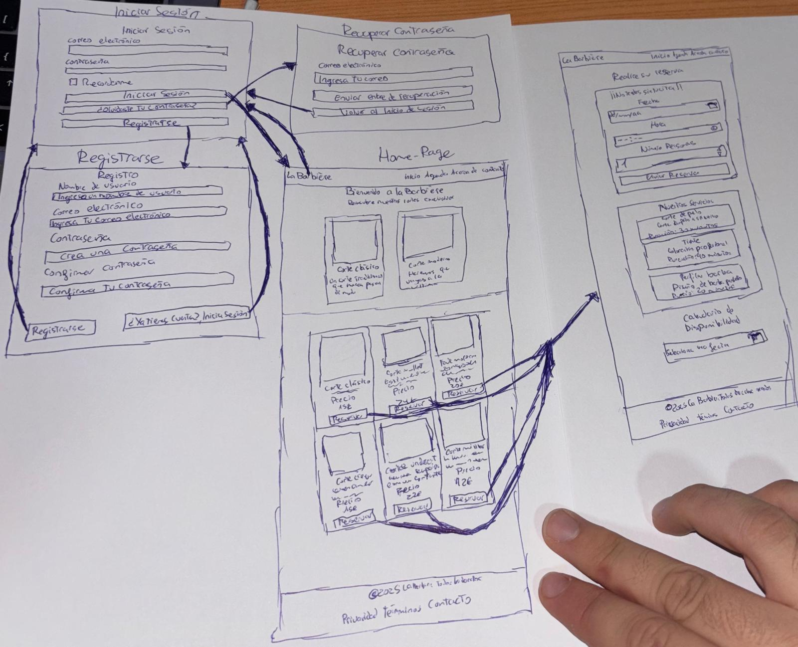
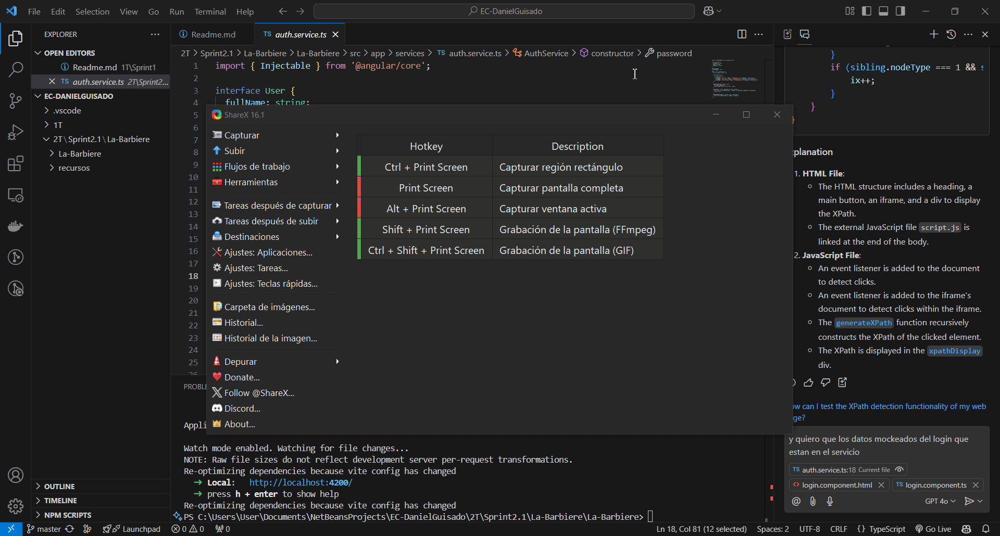
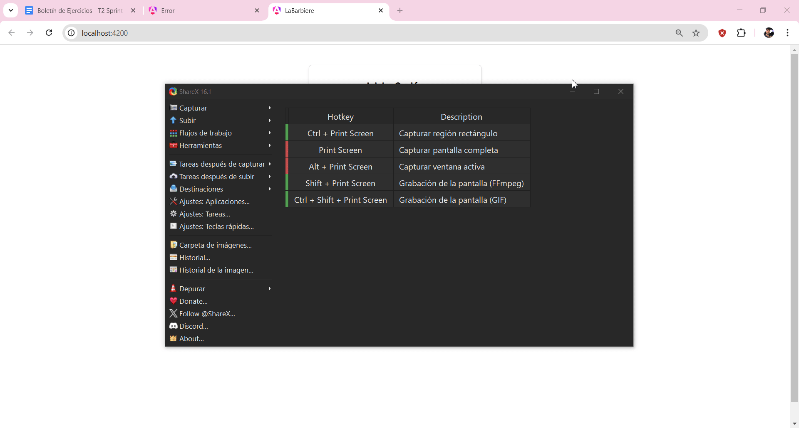
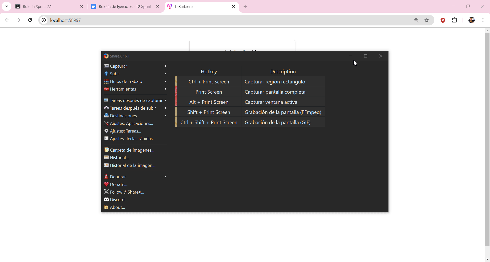
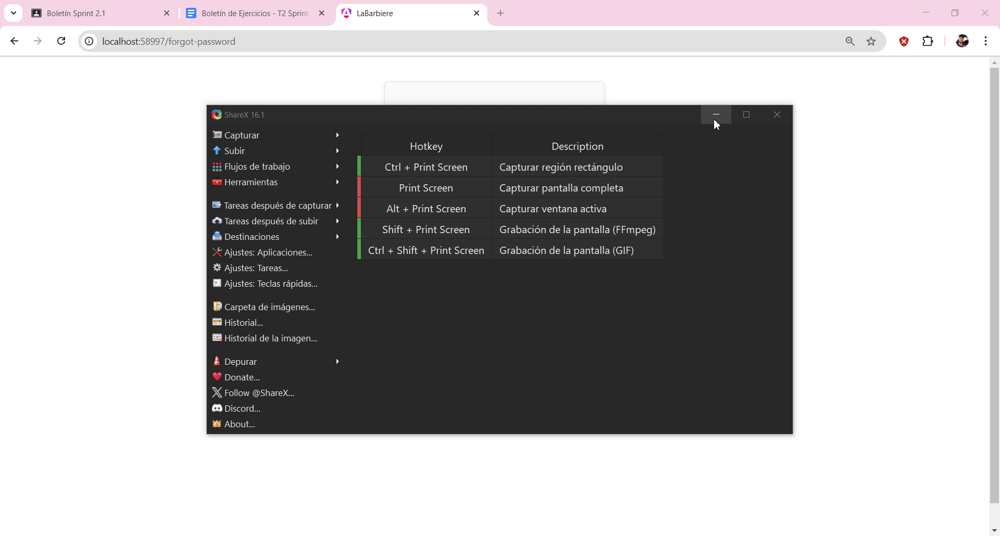

# Ejercicio1
## Análisis del problema
📌 Ejercicio 1: Implementación de la Pantalla de Inicio (Home)
🎯 Contexto
Desarrollar una Pantalla de Inicio funcional, adaptable y estéticamente atractiva, con los elementos mínimos requeridos según la categoría del proyecto seleccionada.
⚙️ Elementos Mínimos independientes de la categoría
🔝 1. Barra de Navegación (Navbar)
🖼️ 2. Sección Principal (Hero Section)
📄 3. Listado Dinámico de Contenido (Content List)
📄 4. Detalle Resumido del Contenido (Content Card)
📝 5. Pie de Página (Footer)

A continuación se detallarán los elementos específicos de cada categoría, que deberían mostrarse obligatoriamente, pero no tienen por qué mostrar funcionamiento

Todo lo que implique el uso de datos, serán mockeados en los .js dentro de services, para simular que se está llamando a una API

🔥 Categoría 1: Explorador de Películas / Música (Netflix / Spotify)
⚙️ Elementos Específicos
1️⃣ Carrusel de Contenido Destacado (MovieCarousel.jsx)
Muestra las películas/música más populares.
Incluye portadas, descripciones breves y botón de Reproducir o Ver más. 
2️⃣ Sección de Recomendaciones Personalizadas (RecommendationsList.jsx)
Es el uso del “ContentList.jsx” pero para un listado de datos concretos.
Basado en preferencias del usuario.
Organizado en categorías: Populares, Tendencias, Nuevos lanzamientos.
3️⃣ Tarjetas de Contenido (MovieCard.jsx)
Es el uso del “ContentCard.jsx” pero para unos de datos concretos.
Imagen del contenido, título, género, duración y botones de interacción.

🛒 Categoría 3: Sitio de Ventas (Salesforce / Shopify)
⚙️ Elementos Específicos
1️⃣ Barra de Filtros Avanzados (ProductFilter.jsx)
Filtros por categoría, precio, marca y valoración.
2️⃣ Tarjetas de Producto (ProductCard.jsx)
Es el uso del “ContentCard.jsx” pero para unos de datos concretos.
Imagen del producto, nombre, precio y botón Añadir al carrito, Abrir Chat o Abrir Configurador.
3️⃣ Resumen de Carrito (CartPreview.jsx), Chat de Venta o Pantalla del Configurador
Icono de carrito con resumen de productos añadidos.

📅 Categoría 4: Sitio de Reservas (Restaurantes / Peluquerías)
⚙️ Elementos Específicos
1️⃣ Formulario Rápido de Reservas (QuickActionForm.jsx)
Campos: Fecha, hora, número de personas/servicio.
Botón Reservar ahora.
2️⃣ Listado de Servicios Disponibles (ServiceList.jsx)
Detalles de servicios: nombre, descripción, duración.
3️⃣ Calendario de Disponibilidad (AvailabilityCalendar.jsx)
Visualización de fechas y horarios disponibles (según el mock).

📰 Categoría 5: Blogs, Foros o Wikis (Wikipedia / Forocoches)
⚙️ Elementos Específicos
1️⃣ Sección de Artículos Destacados (FeaturedPost.jsx)
Es el uso del “ContentCard.jsx” pero para unos de datos concretos.
Muestra publicaciones populares o recientes.
2️⃣ Lista de Publicaciones (PostList.jsx)
Es el uso del “ContentCard.jsx” pero para unos de datos concretos.
Vista previa de artículos con título, autor, fecha y resumen.
3️⃣ Botón de Crear Publicación (NewPostButton.jsx)
Permite crear nuevas entradas.

## Diseño de la propuesta de solución del problema
- He hecho uso de módulos propiamentes de angular como ngfor,ngmodel,ngif,etc.Algunos no me los aceptaba así que tenía que importar módulos especiales como CommonModule y ReactiveFormsModule.
- Página Principal (Home): Muestra servicios disponibles, un formulario de reserva y un calendario para seleccionar horarios.
- Reservas: Los usuarios pueden elegir fecha, hora, número de personas y servicio.
- ContentCard: Tarjetas para mostrar información de servicios.
- ServiceList: Lista de servicios con detalles como nombre, descripción y duración.
- QuickActionForm: Formulario rápido para seleccionar datos de reserva.
- AvailabilityCalendar: Calendario para elegir fechas y horarios.
- Habrá dos servicios,en los que en uno consumirán todos los componentes de lo que es la página principal y la pestaña de reservas y el otro servicio lo consumirán los componentes de registrar usuarios,iniciar sesión y recuperar contraseña.En este caso consumirá de reservationsServices

 

## Pruebas de la resolución del problema
- ✅ Prueba: Comprobación de elementos mínimos y específicos
Navegar a la pantalla de Home.
Comprobar que aparecen los elementos mínimos y específicos definidos anteriormente con el detalle descrito en los diferentes enumerados.

 

 

# Ejercicio2
## Análisis del problema
📌Ejercicio 2: Implementación de Módulos de Autenticación (Login, Registro y Recuperación de Contraseña)
🎯 Contexto
 El objetivo de este ejercicio es desarrollar un sistema de autenticación completo para la aplicación web. Se deben implementar los componentes de Login, Registro y Recuperación de Contraseña con validaciones avanzadas, interacción con la API mockeadas y una experiencia de usuario fluida y segura.

⚙️ Requerimientos Funcionales
1️⃣ Formulario de Inicio de Sesión (Login)
- Campos:
-Correo Electrónico (Email)
-Contraseña (Password)
-Casilla de "Recordarme" (Remember Me)
- Botones:
-Iniciar Sesión
-¿Olvidaste tu contraseña? (Redirige al formulario de recuperación)
- Validaciones:
-El correo debe tener un formato válido.
-La contraseña no puede estar vacía.
-Mostrar errores en tiempo real.
- Flujo de Inicio de Sesión:
-Al hacer clic en Iniciar Sesión, se debe validar el formulario.
-Si las credenciales son correctas (Poner por defecto el valor 4dA1Ts_2425), redirigir al panel principal.
-Si hay error (credenciales inválidas), mostrar mensaje claro mediante el NotificationSystem.

2️⃣ Formulario de Registro (Register)
- Campos:
-Nombre de Usuario (Username)
-Correo Electrónico (Email)
-Contraseña (Password)
-Confirmar Contraseña
- Botones:
-Registrarse
-¿Ya tienes una cuenta? Inicia Sesión (Redirige al formulario de login)
- Validaciones:
-Email con formato válido.
-La contraseña debe tener al menos 8 caracteres, incluir una mayúscula, un número y un símbolo.
-Confirmar que ambas contraseñas coinciden.
-Verificación de duplicidad de correo o usuario mediante la API.
-Validaciones en tiempo real.
- Flujo de Registro:
-Al registrarse correctamente, mostrar notificación de éxito y -redirigir al login.
-Si ocurre un error (simularlo a mano), mostrar notificación de error.

3️⃣ Formulario de Recuperación de Contraseña (Forgot Password)
- Campos:
-Correo Electrónico (Email)
- Botones:
-Enviar Enlace de Recuperación
-Volver al Inicio de Sesión
- Validaciones:
-El correo debe tener un formato válido.
-Verificar si el correo está registrado.
- Flujo de Recuperación:
-Al enviar el formulario, se debe enviar una solicitud a la API (pintar por consola lo que se mandaría en la llamada) para enviar el enlace de recuperación.
-Mostrar notificación de éxito si se envía el correo.
-Mostrar error si el correo no está registrado o si falla la API. (simularlo a mano)

## Diseño de la propuesta de solución del problema
- He hecho uso de módulos propiamentes de angular como ngfor,ngmodel,ngif,etc.Algunos no me los aceptaba así que tenía que importar módulos especiales como CommonModule y ReactiveFormsModule.
- Inicio de Sesión: Permite a los usuarios ingresar con correo y contraseña. Incluye opciones de "Recordarme" y enlaces para registrarse o recuperar la contraseña.
- Registro: Formulario para crear una nueva cuenta con nombre, correo y contraseña. Incluye validaciones básicas.
- Recuperación de Contraseña: Envía un enlace de recuperación al correo ingresado si está registrado. Muestra mensajes claros en caso de éxito o error.
- Habrá dos servicios,en los que en uno consumirán todos los componentes de lo que es la página principal y la pestaña de reservas y el otro servicio lo consumirán los componentes de registrar usuarios,iniciar sesión y recuperar contraseña.En este caso consume de AuthServer
 

## Pruebas de la resolución del problema
- ✅ Prueba 1: Inicio de Sesión Correcto
Ingresar un correo y contraseña válidos.
Hacer clic en Iniciar Sesión.
Verificar que el usuario es redirigido al panel principal.
Confirmar notificación de éxito.

 

- ❌ Prueba 2: Error en Inicio de Sesión
Ingresar credenciales incorrectas.
Verificar que aparece una notificación de error.

- 🆕 Prueba 3: Registro con Validaciones
Ingresar datos inválidos (correo incorrecto, contraseñas que no coinciden).
Verificar que se muestran mensajes de error en tiempo real.
Corregir los datos y completar el registro.
Verificar notificación de éxito y redirección al login.

 

- 🔐 Prueba 4: Recuperación de Contraseña
Ingresar un correo registrado.
Verificar que se envía un aviso de correo de recuperación enviado.
Probar con un correo no registrado y verificar el mensaje de error.

 

